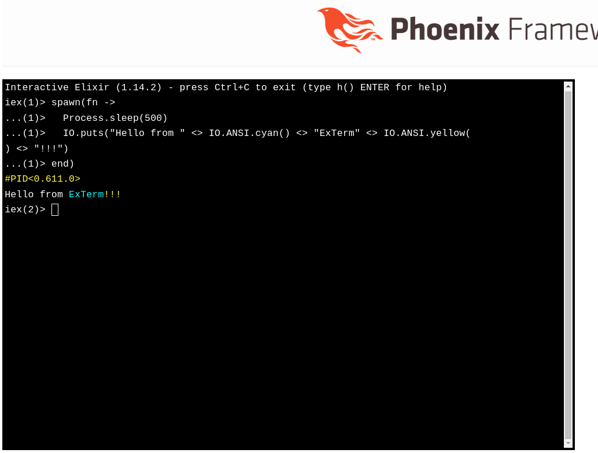

# ExTerm




ExTerm is a terminal `Phoenix.LiveView`.  By default, ExTerm provides an IEx 
terminal usable as a web interface, however, this is customizable and you may
use ExTerm for other CLIs.

Under the hood, ExTerm is a generic interface for converting erlang IO protocol 
messages into web output and translating web input into responses in the IO 
protocol.

## Installation

Add ExTerm to your mix.exs:

```elixir

def deps do
[
  # ...
  {:ex_term, "~> 0.2"}
  # ...
]
end
```

```elixir

def deps do
[
  # ...
  {:ex_term, "~> 0.2"}
  # ...
]
end
```

### How to create a live terminal in your Phoenix router

You must supply a `Phoenix.PubSub` server that is the communication channel
to send important updates to the liveview.  It's recommended to use the
PubSub server associated with your web server.

```elixir
import ExTerm.Router

scope "/live_term" do
  pipe_through :browser

  live_term "/", pubsub_server: MyAppWeb.PubSub
end
```

## Documentation

Documentation is available on hexdocs.pm: https://hexdocs.pm/ex_term

### Planned (Pro?) features:
- provenance tracking
- multiplayer mode
